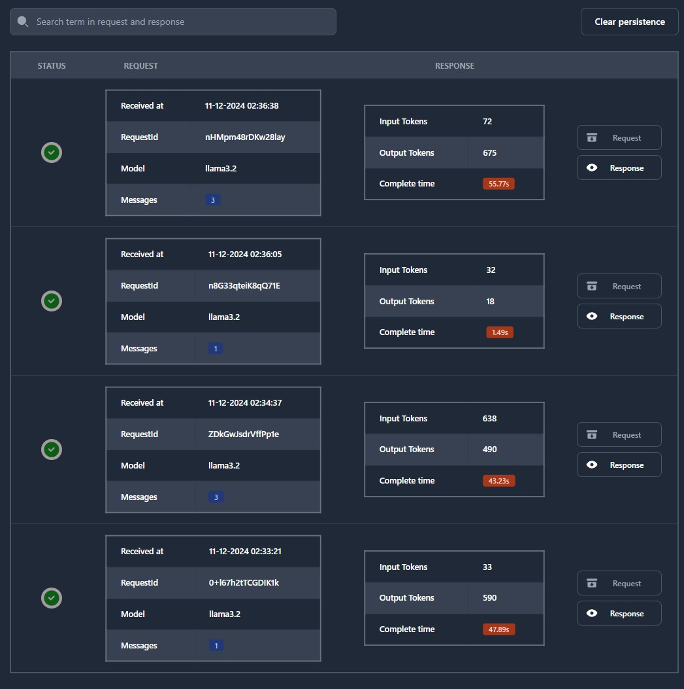
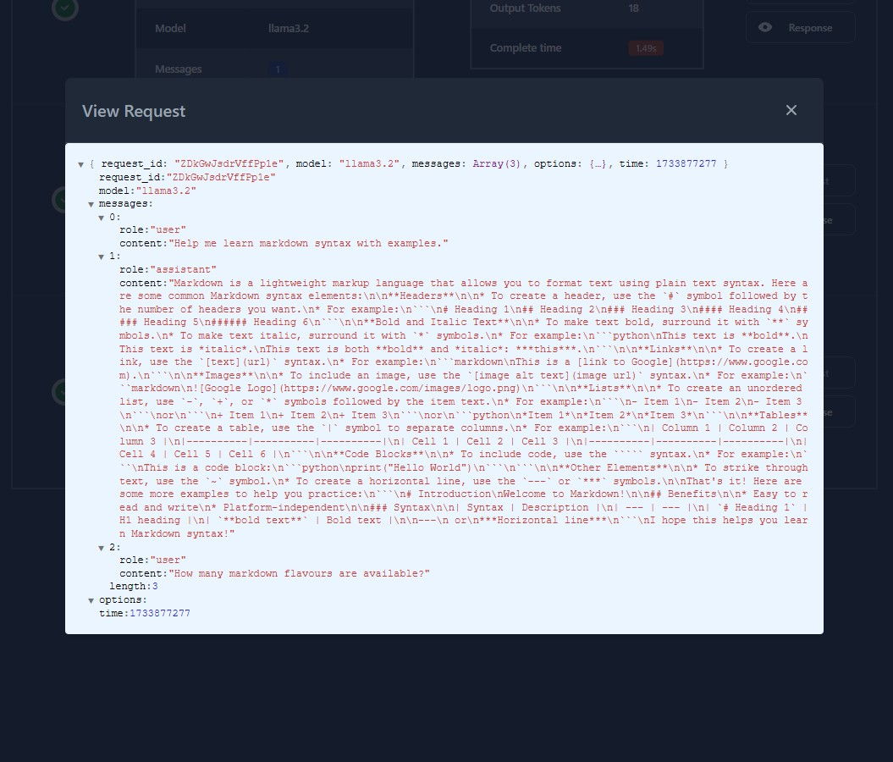
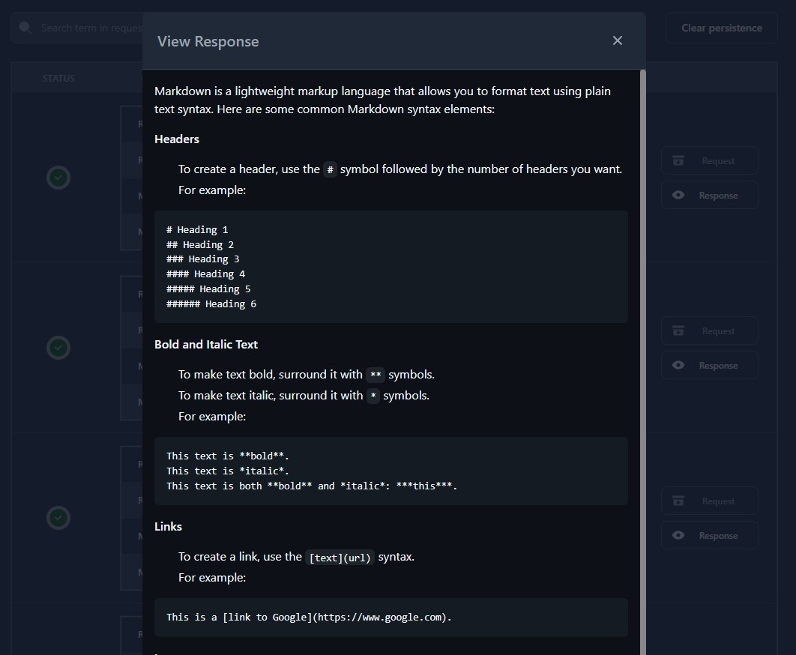

> [!IMPORTANT]  
> This repo contain core changes to the original Ollama repository.
> Is adviced to not use this feature in production environment.
> I'm not responsible for any damage caused by this feature.

### Ollama API Monitor

#### Features
  - [x] Intercept and save request data
  - [x] Intercept and associate responses with requests
  - [x] Save request and response data to browser `localStorage`

#### Requirements
  - Build Ollama from source adding `github.com/gorilla/websocket` and `github.com/sumit-tembe/gin-requestid` dependencies


#### Installation
Clone ollama repository and go to the directory
```bash
git clone https://github.com/ollama/ollama.git
cd ollama
```
Copy modified files from `ollama-changes` to `ollama` directory
```bash
cp -r ../path/to/ollama-changes/* .
```
Check if patch applies successfully and there are no conflicts
```bash
git apply --stat ollama-monitor-ui.patch
```
If there are no conflicts, apply the patch
```bash
git am --keep-cr --signoff < ollama-monitor-ui.patch
```
Install dependencies
```bash
go get github.com/gorilla/websocket
go get github.com/sumit-tembe/gin-requestid
```
Build and run the server
```bash
go build .
./ollama serve
```

#### Usage
Open the browser and go to `http://localhost:11434/monitor`


### Screenshots


